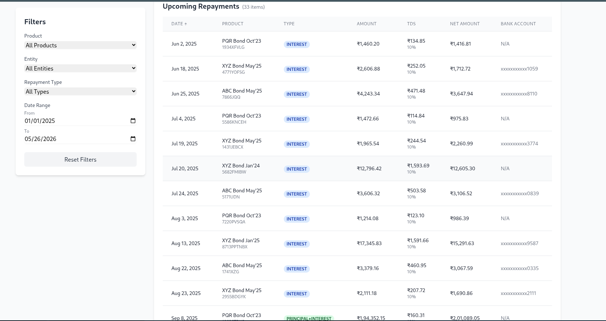
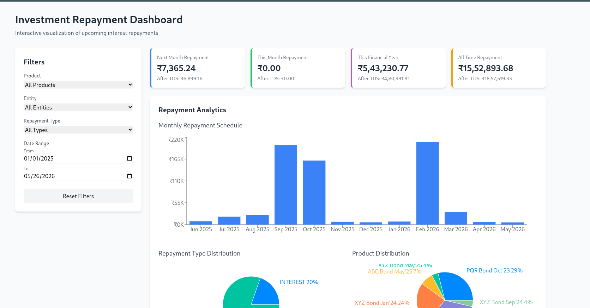

# Investment Repayment Dashboard

An interactive visualization dashboard for tracking and analyzing upcoming interest repayments from investments.



## Table of Contents

- [Features](#features)
- [Screenshots](#screenshots)
- [Installation](#installation)
- [Usage](#usage)
- [Project Structure](#project-structure)
- [Configuration](#configuration)
- [Customization](#customization)
- [Technologies Used](#technologies-used)
- [Troubleshooting](#troubleshooting)

## Features

- **Comprehensive Filtering Options**:
  - Filter by product name (ABC, XYZ Bond)
  - Filter by entity (company a, company b)
  - Filter by repayment type (INTEREST, PRINCIPAL+INTEREST)
  - Filter by date range with customizable start and end dates

- **Interactive Sorting**:
  - Sort repayments by date, product name, or amount
  - Toggle between ascending and descending order

- **Visual Data Representations**:
  - Monthly repayment schedule bar chart showing distribution over time
  - Repayment type distribution pie chart (Interest vs Principal+Interest)
  - Product distribution pie chart showing allocation across different investments

- **Summary Statistics**:
  - Next month repayment totals (before and after TDS)
  - This month repayment totals
  - Financial year repayment totals
  - All-time repayment totals

- **Detailed Repayment Table**:
  - Complete information for each repayment including dates, amounts, TDS details
  - Visual indicators for repayment types
  - Bank account information

## Screenshots

### Dashboard Overview


### Repayment Table with Filtering


## Installation

### Prerequisites
- Node.js (v18 or higher)
- pnpm (v8 or higher)

### Setup Instructions

1. Clone the repository:
```bash
git clone https://github.com/savitojs/interest-repayment-dashboard.git
cd investment-repayment-dashboard
```

2. Install dependencies:
```bash
pnpm install
```

3. Ensure you have the required configuration files in the root directory:
- `package.json`
- `tsconfig.json`
- `tsconfig.app.json`
- `tsconfig.node.json`
- `vite.config.ts`
- `index.html`

4. Place your investment data JSON file in the `public` directory as `invest.json`.

## Usage

### Development Mode

Run the development server:
```bash
pnpm run dev
```

Access the dashboard at http://localhost:5173

### Production Build

Create a production build:
```bash
pnpm run build
```

The build output will be in the `dist` directory, which can be deployed to any static hosting service.

Preview the production build locally:
```bash
pnpm run preview
```

## Project Structure

```
investment-repayment-dashboard/
├── public/
│   ├── invest.json       # Investment data
│   └── vite.svg          # Favicon
├── src/
│   ├── components/
│   │   ├── Dashboard.tsx           # Main dashboard component
│   │   ├── FilterPanel.tsx         # Filtering controls
│   │   ├── RepaymentCharts.tsx     # Data visualizations
│   │   ├── RepaymentTable.tsx      # Tabular data display
│   │   ├── SummaryCards.tsx        # Summary statistics
│   │   └── ui/                     # UI components
│   ├── lib/
│   │   └── utils/
│   │       ├── data-processor.ts   # Data processing utilities
│   │       └── debug-fetch.js      # Debugging utilities
│   ├── App.tsx                     # Main application component
│   ├── main.tsx                    # Application entry point
│   └── index.css                   # Global styles
├── index.html                      # HTML entry point
├── tsconfig.json                   # TypeScript configuration
├── vite.config.ts                  # Vite configuration
└── package.json                    # Project dependencies
```

## Configuration

### Changing Default Filter Date

To change the default filter starting date from 01/01/1970, modify the `filters` state initialization in `src/App.tsx`:

```javascript
const [filters, setFilters] = useState({
  product: '',
  entity: '',
  repaymentType: '',
  dateRange: { 
    // Change this value to set a different default start date
    start: new Date('2025-01-01').getTime(), 
    end: Date.now() + 31536000000 
  }
});
```

### Data Format

The dashboard expects a JSON file with the following structure:

```json
{
  "upcomingRepayments": {
    "totalRepaymentNextMonth": number,
    "totalRepaymentNextMonthAfterTds": number,
    "totalRepaymentAllTime": number,
    "totalRepaymentAllTimeAfterTds": number,
    "totalRepaymentThisMonth": number,
    "totalRepaymentThisMonthAfterTds": number,
    "totalRepaymentThisFinancialYear": number,
    "totalRepaymentThisFinancialYearAfterTds": number,
    "repaymentsList": [
      {
        "productId": number,
        "productName": string,
        "scripCode": string,
        "entityName": string,
        "repaymentDate": number,
        "status": string,
        "principalRepayment": number,
        "interestRepayment": number,
        "tdsPercentage": number,
        "tdsValue": number,
        "totalRepaymentBeforeTds": number,
        "totalRepaymentAfterTds": number,
        "totalQuantity": number,
        "repaymentType": string,
        "transferredTo": {
          "accountNo": string,
          "bankLogo": string
        },
        "timeRanges": number[],
        "productType": string,
        "isTdsOnInterestApplicable": boolean,
        "tdsExemptionThresholdAmount": number
      }
    ]
  }
}
```

## Customization

### Styling

The dashboard uses Tailwind CSS for styling. You can customize the appearance by:

1. Modifying the Tailwind configuration in `tailwind.config.js`
2. Adding custom CSS in `src/index.css`
3. Updating component-specific styles in their respective files

### Adding New Features

To add new visualizations or features:

1. Create new components in the `src/components` directory
2. Add data processing utilities in `src/lib/utils/data-processor.ts`
3. Update the main `Dashboard.tsx` component to include your new features

## Technologies Used

- **React**: UI library
- **TypeScript**: Type-safe JavaScript
- **Vite**: Build tool and development server
- **Tailwind CSS**: Utility-first CSS framework
- **Recharts**: Charting library for data visualization
- **date-fns**: Date manipulation library

## Troubleshooting

### Common Issues

#### 404 Error When Loading JSON Data

If you encounter a 404 error when loading the JSON data:

1. Ensure `invest.json` is in the `public` directory
2. Verify you're accessing the dashboard at the correct URL (http://localhost:5173/)
3. Try modifying the fetch path in `src/App.tsx` to use a relative path:
   ```javascript
   const response = await fetch('./invest.json');
   ```

#### Missing CSS Styles

If the dashboard loads without styles:

1. Check that your `index.css` includes the Tailwind directives:
   ```css
   @tailwind base;
   @tailwind components;
   @tailwind utilities;
   ```
2. Verify that `tailwind.config.js` and `postcss.config.js` are properly configured
3. Ensure the CSS is being imported in `main.tsx`

#### Build Errors

If you encounter TypeScript errors during build:

1. Run the build with the `--force` flag to ignore TypeScript errors:
   ```bash
   SKIP_TYPECHECK=true pnpm run build
   ```
2. Fix the TypeScript errors in the source code for a cleaner build

---
